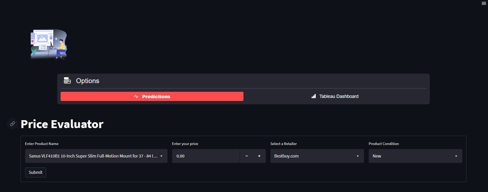
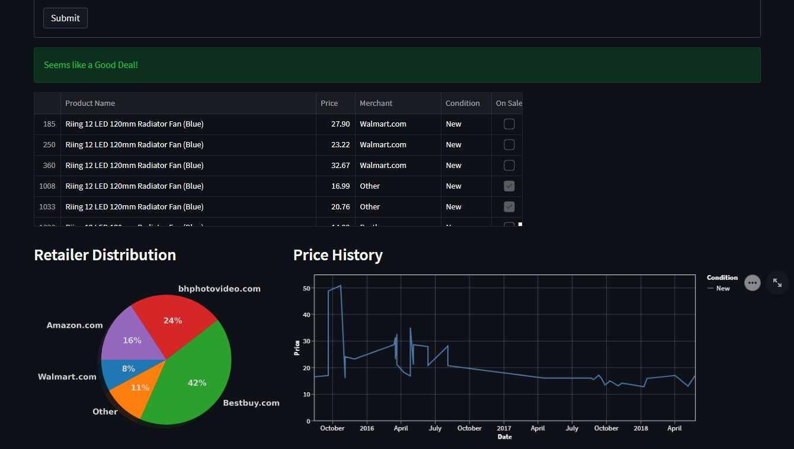
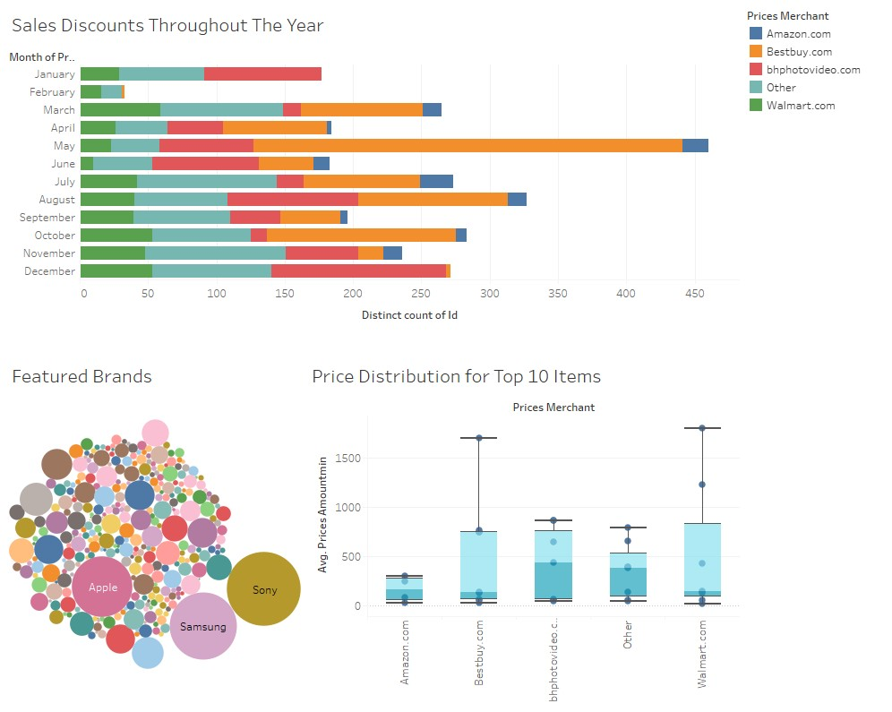
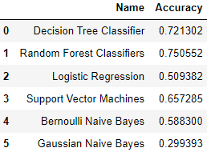

# Price Evaluator
### A Streamlit app that not only predicts whether you're getting a discounted price, but also gives a list of deals offered at other top retailers.
Everyone always wants to know the best times to buy a certain item (i.e. should I wait until Black Friday) or whether they're getting the 'best' deal. The Price Evaluator app uses machine learning to predict whether a deal is discounted, in order to help you make that determination.

Try the App here: https://justgitcoding-price-evaluator-app-dashboardapp-2wl09m.streamlitapp.com/

## The Prediction Page

Users of our app are able to select their product from a dropdown menu, enter a price, and select a retailer and condition ('New' or 'Used'), and click "Submit". Our Machine Learning model will immediately make a prediction and a text box will appear either telling them that it 'Seems like a Good Deal!' in green letters, or that the 'Price may not be Discounted.' in yellow letters, prompting users to consider shopping around some more. In either case, the app will also provide a table with all of the observed prices for the selected product, as well as a pie chart with the retailer distribution on this product, and a line graph showing the historical trend in prices. 

## Tableau Dashboard
We also included static visualizations capturing the full dataset in order to tell the story behind our unfiltered data. 
- A stacked bar chart shows the distribution of sales discounts over time. We can see that sales discounts appear most frequently in the summer, and are less prevalent earlier in the year.  
- The Bubble chart shows the distribution of brands in our dataset, with Sony, Apple and Samsung appearing to be the biggest players!

## Data - Extract, Transform & Load (ETL)
### Extract: 
We obtained [Electronic Products and Pricing Data](https://www.kaggle.com/datasets/datafiniti/electronic-products-prices?resource=download) from [kaggle.com](kaggle.com) which includes each individual product id (`id`), minimum selling prices (`prices_amountmin`) observed from various online merchants (`prices_merchant`) as well as the dates that those prices were observed (`prices_dateseen`), and whether the prices observed were "sale" prices (`prices_issale`). 

### Transform:
In order to clean the data, we had to perform several steps:
1. Replaced all periods in column names with underscores.
2. Updated all date columns to be in datetime format.
    - `prices_dateseen` - This column originally included all dates that a price was observed. We decided to only keep the most recent date as it represented the most relevant information.
    - To extract these dates, we used Pandas to split the comma-separated column into individual columns and dropped all but the most recent date from our dataframe.
4. `prices_currency` - We only kept data that was denomiated in USD.
5. `prices_condition` - Using RegEx, we split the data into two classes: 'New' vs 'Used' (including 'pre-owned', 'refurbished', etc). We assumed that all blanks were 'New'.
6. `prices_merchant` - This column was the most difficult to clean as it included mispellings, odd naming conventions, and a host of other issues, which resulted in over 1,500 unique names. Using RegEx, we were able to split the data between the 4 most commonly observed retailers (Walmart, Bestbuy, Amazon, bhphotovideo) and combined the remaining retailers into an 'Other' category.

### Load:
We decided to use Amazon Web Services' (AWS) Relational Database Service (RDS) to host our PostgreSQL database. In order to ensure that everyone always had the most up-to-date version version of the data, each time any data cleaning was performed in our `Data_ETL.ipynb` file, we used the `sqlalchemy` library's `create_engine` function to connect to our database, drop the existing table, and replace it with the newest & cleanest version of the data.

## Machine Learning
### Feature Selection & Target:
The following Features were selected for our Machine Learning model:
1. `id` - The identifier for each unique product.
2. `prices_amountmin` - The lowest price observed for a product on the date specified.
3. `prices_condition` - The 'condition' of a product (i.e. 'New' or 'Used').
4. `prices_merchant` - The merchant selling the product (i.e. 'Walmart.com', 'Bestbuy.com', etc).

Our Target variable is the `prices_issale` field, which indicates whether each data point represents a 'discounted' or 'on-sale' price point.

Note: We initially included the `prices_dateseen` (the date on which the `prices_amountmin` was observed) as a feature in our machine learning model (also experimenting with only keeping the `quarter` or `month` as the feature). However, we eventually realized that this created some over-fitting as our dataset is broken out to thousands of products, while each unique product `id` is only observed, on average, approximately 10-15 times. Once we removed the date features from our model, our accuracy increased by ~5%.

### Data Preprocessing:
We used the `sklearn` library's `LabelEncoder` and `StandardScaler` to preprocess our selected feature and target variables. Additionally, because of the class imbalance observed in our pricing data (discounted prices were far less common than standard prices), we utilized `imblearn.over_sampling.RandomOverSampling` to create an equal distribution in our training data set. We also used the `joblib` library to save our encoders and scalers for future use in our Price Evaluator App.

### Model Selection:
Using our preprocessed dataset, we used a `for` loop to test a number of machine learning models from the `sklearn` library:

Based on these results, we found that the `RandomForestClassifier` provided the highest model accuracy score (`model.score()`). We then used the `joblib` library again to save the trained model for future use in our Price Evaluator App.

## Price Evaluator App
We used Streamlit.io to create and deploy our web application. At the top of our app, we use a `streamlit_option_menu` to allow users to navigate between the 'Predictions' page (default) vs the 'Tableau Dashboard' page. 

On the Prediction page, we use Streamlit's built in `st.form` function to generate a user form which prompts the user for a product name, price, merchant, and condition ('New' or 'Used') and saves them as variables upon the user clicking the "Submit" button. Our app then imports `ML_Evaluator.py` which has a function reads the input variables, loads our Machine Learning model (including data encoders and scaler), and predicts whether the sale conditions are discounted. Based on the output of this function, we use Streamlit's built in `st.success` and `st.warning` functions to generate either a green 'success' box, indicating that the input 'Seems like a Good Deal!' or a yellow 'warning' box, indicating that the input 'May not be Discounted' (we also added `st.balloons` when deals were predicted to be discounted.) 

Upon loading the web application, Streamlit also connects to our AWS database using the `sqlalchemy` library's `create_engine` function (database password stored / retrieved using Streamlit's `st.secrets`), and loads the data as a Pandas dataframe. Using the `.loc` function, we are able to disply only the data that is relevant to the user. We further use both the `matplotlib` and `altair` libraries to generate interactive visualizations based on this filtered dataframe.

On the Tableau Dashboard page, we use `streamlit.components.v1` in order to open our Tableau Public's html embed code, and display our dashboard as a `component` on our website.

## Technology
- Data Cleaning: Pandas, Numpy, and re
- Database: PostgreSQL RDS hosted on AWS
- Machine Learning: Sklearn, Imblearn and Joblib
- Code Editors: Jupyter Notebook / Google Colab / VScode
- Dashboard: Streamlit, Lottie, Matplotlib, Altair, Tableau, HTML
